# **Uni-Portal**

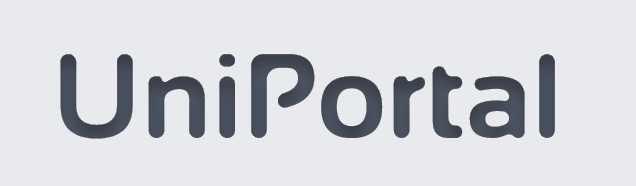

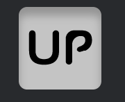

*Uni-Portal* is a full stack web application that i developed for my diploma thesis in the Department of Computer Science and Engineering at University of Ioannina. It offers the user unified access, through its graphical interface, to 3 different accounts that
he/she uses to communicate daily. Specifically, the user is able to connect to the
application 2 different Gmail accounts, as well as 1 Microsoft Teams account, so that he/she
can then create new conversations, read messages from his/her 3 different accounts,
organize his/her incoming messages into threads and mark them as important, or unread, in
the case of the Gmail accounts, as well as send new messages, each one having the
appropriate account as the sender.

# Technologies used

- **MongoDb**
- **Express.Js**
- **React.Js**
- **Node.Js**

# Web APIs used

- **Gmail API**
- **Microsoft Graph API**

# Authorization Protocol used
- **OAuth 2.0**

# Features / User Stories

## Unified access

- Connect the 2 Gmail, and Microsoft
Teams account to the app. On the Home page of the app
there are three tabs, one for each account, from which
you can access all the functions related to that account.
Above the tabs should be the Gmail #1, Gmail #2 buttons,
MsTeams, and clicking on them will activate the appropriate tab, for
access to the appropriate account.

## Gmail accounts

1. Retrieve incoming messages of the 2 differrent
Gmail accounts, from the Home page of the application and the
appropriate tab. The messages are split into two lists,
unread and important, as well as organized in chat
threads, one below the other.

2. View all messages in a thread
from a Gmail account by clicking on it. The thread
opens and displays a list of all messages in the conversation.

3. Send a message to an already existing
thread, from a Gmail account. When opening the thread, and after the
most recent message, there is a form that allows you to reply to the thread. There are also appropriate buttons for actions such as
include attachment, delete attachment, and delete
message before it is sent.

4. Retrieve an attachment of a message from a Gmail account. The attachments of a message are located in
a list within the message, and by clicking on one of them, the
attachment will be downloaded.

5.  Tag a message thread from
a Gmail account as read, or important. When opening
an unread thread, the thread is marked as read.
When clicking on a thread's star, the thread is
marked as important and its star becomes selected,
whereas if the thread was already important, it is marked as not important
important, and the star is no longer selected.

6. View a message in the form of a simple
text, html, html with reply quotes, or minimize it, so that you can view it in the way that suits you best.
Each message has the appropriate buttons these actions.

7. Send a new message
from a Gmail account. There is a Compose button
and by pressing it a proper form will be brought up, to send a new
message. Also there are appropriate buttons to
send an attachment, delete an attachment, and delete the
message before it is sent.

## Microsoft Teams account

1.  Retrieve all chats from the
Microsoft Teams account from the Home page of the app, and
the appropriate tab. There will be a list of members that participate on each chat on the left, and on the right there will be a list of messages
of the selected chat. The messages of a chat are displayed
on the right when clicking on the appropriate chat from the chat list.

2. Create a new chat for your
Microsoft Teams account. There is an input field
that allows to enter the email address of the user with the
whom you want to create a new chat, and by pressing *Enter* the
chat is created and selected from the list of chats.

3. Send a new message
to a chat on your Microsoft Teams account. When having the chat selected,
there is a form underneath the chat messages that allows it.

4. Send an attachment to a
chat of your Microsoft Teams account. Under the message form
of the selected chat there is a button that allows you to do so.

# Application execution examples

## *Login page*
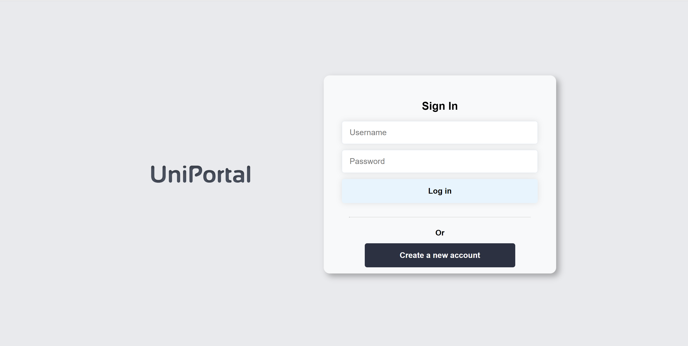
<div style="height: 100px"></div>

## *Home page - gmail #1 tab*
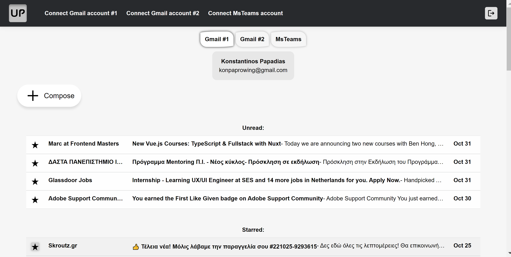
<div style="height: 25px"></div>
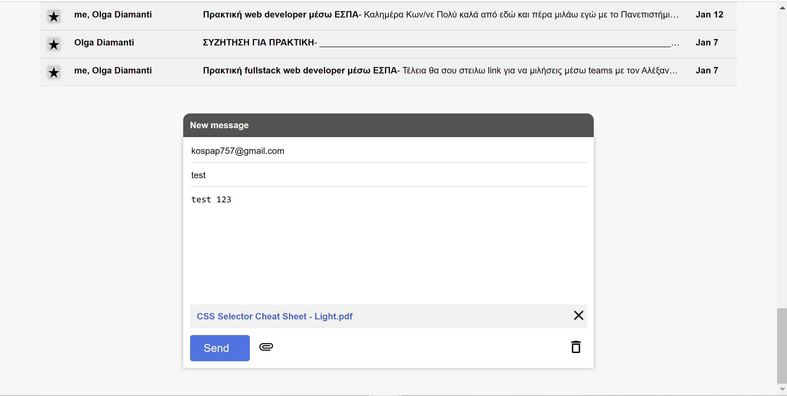
<div style="height: 25px"></div>
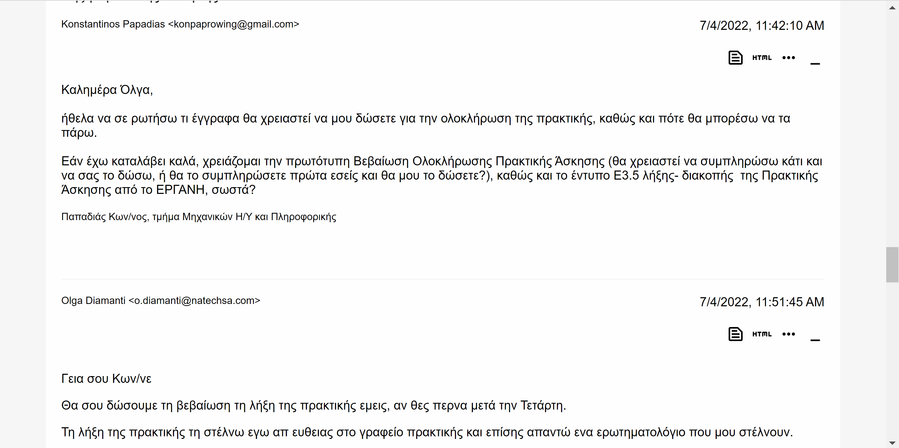
<div style="height: 25px"></div>
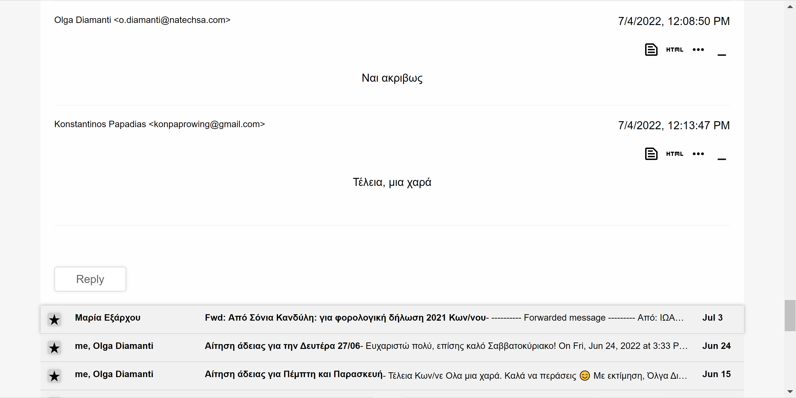
<div style="height: 25px"></div>
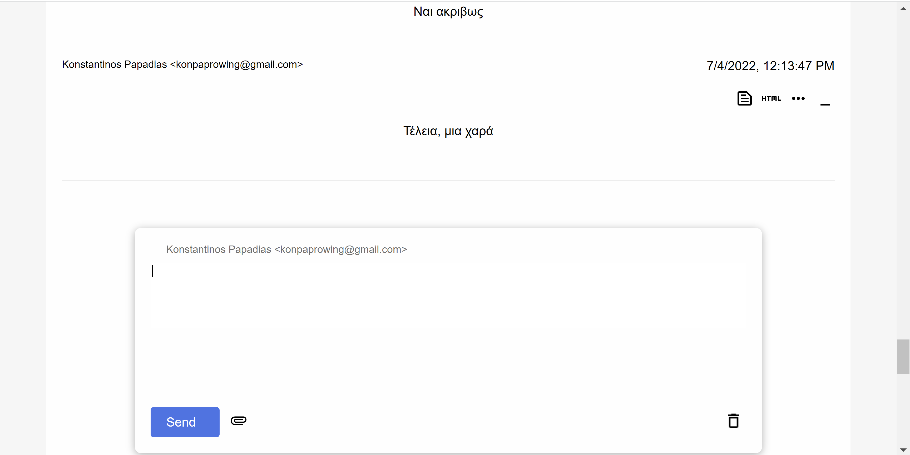
<div style="height: 100px"></div>

## *Home page - msTeams tab*
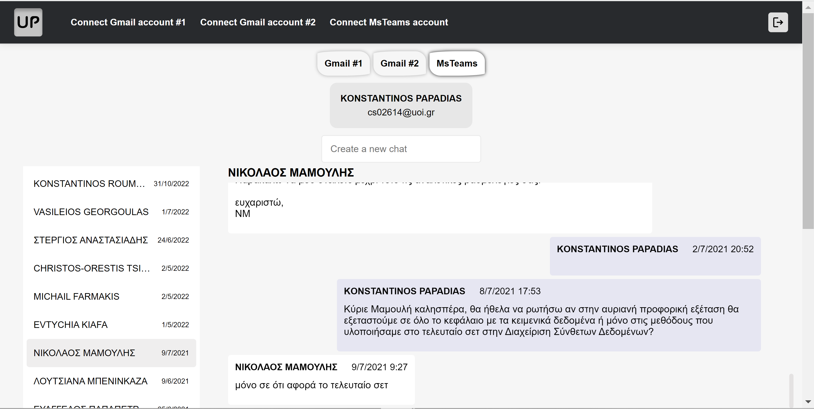
<div style="height: 25px"></div>
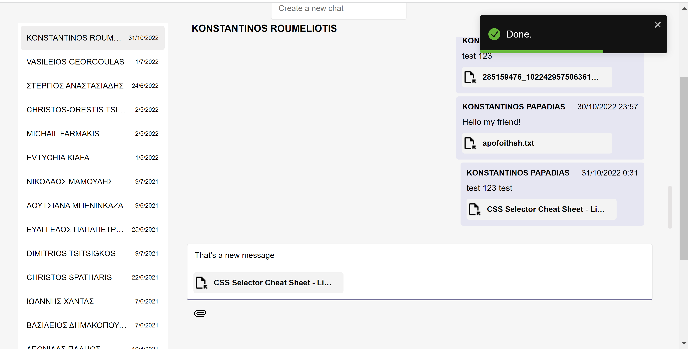
<div style="height: 100px"></div>

# Application architecture

The frontend
is a React single-page application. It accepts
requests from the user (via the GUI), and to satisfy them it
sends requests to the backend application server, via the server's RESTful API. The
backend application server, then, satisfies the frontend requests, by communicating, when necessary, with the web APIs of the providers
(i.e. the Gmail API, and the Microsoft Graph API), and, eventually, responds to the
frontend, which updates its page DOM. The
application server, also, communicates with the database to retrieve
and store data.

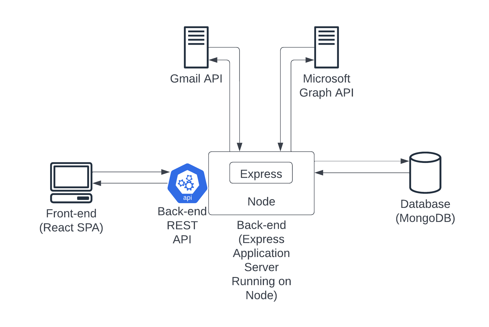
<div style="height: 50px"></div>

# Thesis report

The entire thesis report can be found [here](./thesis_Papadias_Konstantinos_2614.pdf)

# Installation and execution

1. Install a local MongoDb server and start it.
2. Install Node.js and npm.
3. Create a Google cloud web application project, enable Gmail API, create credentials (client id, client secret) and set 2 OAUth 2.0 redirect URIs to *http://localhost:3001/api/connect/gmail1/callback*, and *http://localhost:3001/api/connect/gmail2/callback*, respectively.
4. Create a Microsoft Azure web application project, add the following API permissions: *Chat.ReadWrite*, *Files.ReadWrite.All*, *offline_access*, *User.Read*, *User.ReadBasic.All*, enable access and id tokens issueing, create credentials (client id, client secret) and set OAUth 2.0 redirect URI to *http://localhost:3001/api/connect/msTeams/callback*.
5. Navigate to the *server* folder, and create a *.env* file with the following key-values:
    1. PORT=3001
    2. DATABASE_URL={*Your local MongoDb server's connection string*}
    3. AES_KEY={*Your AES secret*}
    4. SESSION_SECRET={*Your session secret*}
    5. GOOGLE_CLIENT_ID={*Your Google client id*}
    6. GOOGLE_CLIENT_SECRET={*Your Google client secret*}
    7. GMAIL1_CALLBACK_URL=http://localhost:3001/api/connect/gmail1/callback
    8. GMAIL2_CALLBACK_URL=http://localhost:3001/api/connect/gmail2/callback
    9. MICROSOFT_CLIENT_ID={*Your Microsoft client id*}
    10. MICROSOFT_CLIENT_SECRET={*Your Microsoft client secret*}
    11. MS_TEAMS_CALLBACK_URL=http://localhost:3001/api/connect/msTeams/callback
6. Navigate to the *server* folder and run ```npm install```, to install all back-end server dependencies.
7. Inside the *server* folder run ```npm start```, to run the back-end server.
8. Navigate to the *client* folder and run ```npm install```, to install all front-end/react server dependencies.
9. Inside the *client* folder run ```npm start```, to run the front-end/react server.
10. Open your browser of choice and go to http://localhost:3000/ to use the application.

# Author

[*Konstantinos Papadias*](https://github.com/KonstantinosPapadias)